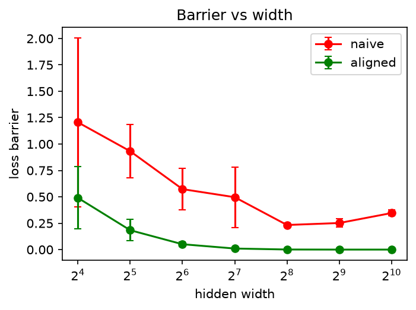

# When Do Two Networks Become One?
### Width, Alignability, and the Geometry of Linear Mode Connectivity

The project asks **why** weight matching becomes dramatically more effective as network width grows: is the width effect mediated by neuron alignability, or do additional geometric mechanisms (basin flatness) contribute?

**Ekaterina Nikitina**



## Findings

- After Git-Re-Basin-style weight matching, the MLP error barrier drops from **0.14 ± 0.06** (width 16) to **≤ 0.006** (width ≥ 256); naive interpolation only improves from 0.32 to 0.07.
- Alignability mediates most of the cross-width trend: the standardized width coefficient shrinks from **−0.74 to −0.22** after controlling for alignability.
- The effect is *not* pure alignability. On the non-censored subset (w ≤ 128, where barriers are not floored at zero) a residual width effect of **−0.53** remains and replicates on MNIST (**−0.56**). Adding an endpoint-flatness proxy absorbs it (−0.53 → −0.12): flatness acquired during training explains most of the remaining between-width effect.
- Within a fixed width, the **worst-matched neurons** dominate: tail alignability (worst 10%) predicts barrier better than the mean (pooled r = −0.41 vs. −0.31).
- Hub-based k-way merging becomes nearly free above the width threshold (penalty ≤ 0.009 for k = 2/4/8 at w ≥ 256), while naive averaging fails entirely.
- Negative results: REPAIR does not help matched MLP paths (worsens w = 16 by 0.07); CNNs (8–128 channels) show no MLP-like threshold. Zero barrier ≠ functional identity — freely interpolating wide matched pairs still disagree on 6.8% of test inputs.

## Quickstart

```bash
python -m venv .venv && source .venv/bin/activate
pip install -r requirements.txt
python -m pytest test_core.py -q
python run_all.py
```

Individual experiments can also be run directly from the repository root, e.g. `python experiments/exp2_width_sweep.py`. Trained checkpoints are cached in `./ckpt` and reused across experiments; raw outputs are written to `./results/*.json`, figures to `./figures/`. All runs are seeded: `setup()` fixes the global seed before sampling the evaluation subset, and every model is trained with a fixed per-pair seed, so a rerun on the same machine regenerates the reported numbers. The committed `results/` are the exact outputs behind the report: every number in Table 1 is traceable to a JSON in this folder.

### Full reproduction from scratch

To retrain everything and regenerate all results and figures instead of reusing cached checkpoints, archive the current outputs and run the experiments sequentially with fail-fast logging:

```bash
for d in results figures ckpt; do mv "$d" "${d}_old_$(date +%m%d_%H%M)" 2>/dev/null; done
python -m pytest test_core.py -q && for f in exp1_barrier_demo exp2_width_sweep \
  exp3_activation_vs_weight exp4_repair_residual exp5_lmc_over_training exp6_two_layer \
  exp7_robustness exp8_cnn exp9_null exp10_residual exp11_kmerge; do
    echo "$f"; python -u "experiments/$f.py" || exit 1
done 2>&1 | tee rerun.log
```

The full retrain runs on CPU if no GPU is available and takes a few hours; on macOS, prefix the loop with `caffeinate -i` to keep the machine awake for the duration.

## Repository structure

| Script | What it does | In the report |
|---|---|---|
| `exp1_barrier_demo` | Naive vs. matched barrier, single width | Sec. 5, sanity check |
| `exp2_width_sweep` | Main sweep w ∈ {16…1024}, 5 seed pairs; barriers, alignability, mediation regressions | Table 1 (Barrier, Alignability, Mediation) |
| `exp3_activation_vs_weight` | Activation- vs. weight-based matching | additional analysis (not in report) |
| `exp4_repair_residual` | REPAIR along matched paths | Sec. 5, negative result |
| `exp5_lmc_over_training` | Barrier evolution over training snapshots | additional analysis (not in report) |
| `exp6_two_layer` | Two-hidden-layer MLPs | additional analysis (not in report) |
| `exp7_robustness` | Full replication on MNIST | Table 1 (Residual, MNIST) |
| `exp8_cnn` | CNN control, channels 8–128 | Table 1 (CNN), Sec. 5 |
| `exp9_null` | Same-seed untrained null; trained−untrained alignability gap | Sec. 5, null model |
| `exp10_residual` | Flatness proxy, censoring-aware residual analysis, tail alignability | Table 1 (Tail, Residual), Sec. 5 |
| `exp11_kmerge` | Hub-based k-way merging, k ∈ {2,4,8} | Table 1 (k-merge) |

`src/` contains the reusable core: `matching.py` (weight matching), `barrier.py` (interpolation and barriers), `metrics.py` (alignability, mediation, bootstrap), `similarity.py` (CKA, disagreement, flatness proxy), `merging.py` (hub merge), `models.py` / `cnn.py` / `train.py` / `data.py`.

## Implementation details (deferred from the report)

**Training.** One-hidden-layer MLP 784 → w → 10 with ReLU; FashionMNIST (MNIST for replication), pixels scaled to [0, 1]. Adam, constant lr = 1e-3, batch 128, 15 epochs, 5 independent seed pairs per width. Evaluation on a fixed random subset of 5 000 test points.

**Barrier.** Error (and loss) evaluated on a 25-point λ-grid over [0, 1]; barrier is the maximum excess over the linear interpolation of endpoint values (Eq. 1 in the report). Error is the primary metric because endpoint losses vary systematically with width.

**Weight matching.** Iterative coordinate descent over hidden layers in random order (25 iterations), solving each layer's linear assignment problem with `scipy.optimize.linear_sum_assignment`; the cost couples incoming and outgoing weights, as in Git Re-Basin.

**Alignability.** Weight-space feature of hidden unit *i*: concatenation of its incoming weight row and outgoing weight column. Alignability A is the mean cosine similarity between matched units; tail alignability averages the worst q = 10%. In/out block variants are reported in `exp10`.

**Flatness proxy.** Mean loss increase over 5 Gaussian perturbations of all parameters, with per-tensor scale σ = 0.05 · std(tensor) and a fixed noise seed. The null (untrained) flatness is subtracted for the `flatness_excess` variant.

**Statistics.** Standardized OLS regressions B ~ log₂w + A (+ F); stratified pair bootstrap with n = 2000 for confidence intervals; censoring handled by re-running the analysis on the non-censored subset w ≤ 128; within-width correlations reported separately from between-width trends.

**CNN control.** Two 3×3 conv layers + global average pooling, channel widths {8, 16, 32, 64, 128}, trained on a fixed 12k FashionMNIST subset with the same optimizer settings; channel matching mirrors the MLP procedure.

## Correctness

`test_core.py` (19 tests) verifies the pipeline end to end: permutations preserve network function exactly; planted permutations are recovered **bit-exactly** (MLP, two-layer, CNN); barriers vanish on identical endpoints; mediation and bootstrap recover known ground truth on synthetic data; CKA and disagreement are permutation-invariant; hub-merging permuted copies of one model is lossless.

## References

Frankle et al., *Linear Mode Connectivity and the Lottery Ticket Hypothesis*, ICML 2020 · Entezari et al., *The Role of Permutation Invariance in LMC*, ICLR 2022 · Ainsworth et al., *Git Re-Basin*, ICLR 2023 · Jordan et al., *REPAIR*, ICLR 2023 · Singh & Jaggi, *Model Fusion via Optimal Transport*, NeurIPS 2020 · Kornblith et al., *Similarity of Neural Network Representations Revisited*, ICML 2019.
